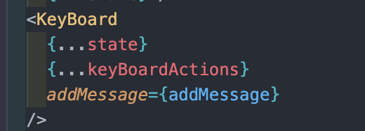
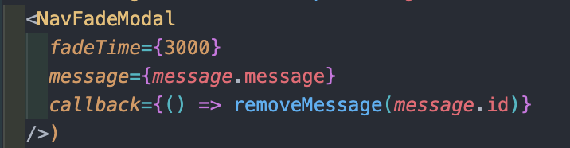
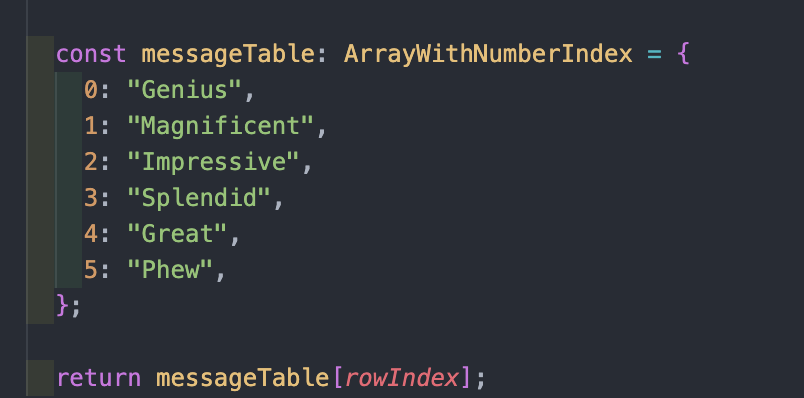

## Wordle Challenge

한때 유행했던 https://www.powerlanguage.co.uk/wordle 를 구현해보고 코드리뷰를 주고 받기 위한 프로젝트 입니다.

1. 게임이라서 버그나 비즈니스 로직에 대한 이해가 확실
2. 비즈니스 로직, 키 이벤트, 버튼 이벤트, 애니메이션 등을 다루기에 적절한 프로젝트라 생각

위의 두 생각에 대한 전제를 바탕으로 프로젝트를 진행하고 코드리뷰를 요청합니다.


## Developing

```shell
yarn
```

## Start

```shell
yarn start
```

## 배포 사이트
https://wordle-challenge-psi.vercel.app/

## 구현영상 


## Requirements 
[x] 키보드를 클릭하여 입력받을 수 있다.   
[x] 키보드를 클릭시 5개 이상은 입력되지 않는다.   
[x] 키보드에 입력받은 단어들의 상태에 대한 결과값이 배경색으로 표시된다.   
[x] 브라우저를 새로고침 하면 이전에 입력한 값이 살아있어야 한다.  
[x] 정답을 맞친 후에는 키보드 입력을 받을 수 없다.   
[x] 시도횟수에 따라 다른 메시지 출력 -> 모달 추가
- 1회만에 성공: Genius
- 2회만에 성공: Magnificent
- 3회만에 성공: Impressive
- 4회만에 성공: Splendid
- 5회만에 성공: Great
- 6회만에 성공: Phew
- 실패: 정답을 알려준다
  
[x] 성공한 후 결과 출력 -> 모달 추가   
[x] 지우는 동작후 다시 입력했을때 에러나는 부분 버그 수정   
[x] 정답 후에 초기화 버튼 추가    
[x] eslint, prettier 추가
[ ] 모달 css 처리   
[ ] 엔터 눌렀을때 애니메이션   
[ ] 글자 입력되었을때 애니메이션 동작   
[ ] 정답일때와 아닐때 애니메이션 동작   
[ ] 다크/안다크 모드 추가   
[ ] 영어/한국어 버전 추가   
[ ] 반응형 작업   
[ ] 테스트 코드    


## 고민사항들
0) 너무 많은 상태와 함수들이 props 전달되어야 한다.    
   => spread operator 사용, { ...state, ...actions } 
   => 설계가 잘못된 것은 아닐까???     
   => 우선은 두개의 컴포넌트에서 가장 가까운 부모 위치에 컴포넌트를 위치시켰는데 이것을 redux로 변환했어야 했을까?    
   => redux나 recoil은 너무 heavy 한것 아닐까??      
  

------

1) 하나의 함수에서 하나의 역할만 하게 하고 싶은데 지금은 너무 덩어리가 커지고 있다.    
    1) clickEnter에서 하는일이 너무 많다.       
      1) 입력 받은 단어 비교     
      2) 정답 여부 파악    
      3) currentInput 초기화   
    => dispatch 여러개로 분리 (기대효과: 하나의 액션에서는 하나의 기능만 수행)   
    => 배치 업데이트로 인해 한번만 발생함     

------

2) 지금 작성하고 있는 컴포넌트들이 재사용이 가능할까?   
    => 재사용이 불가능할것 같은데 어떤 방법으로 변경하는 것이 좋을까?    
    => 의존성 주입, ex) callback function은 외부에서 넣어줌, js에서의 filter 함수, html select tag 같은 예시    
    

------

3) 같은 모달의 역할 이지만 두개의 위치가 다르고 쓰임새가 다르므로 
    => 우선 별도의 모달로 생성
    => 추후에 css와 fade action동작 구현되면 합칠지 결정

------

4) 리듀서 내부에 이상한 로직들은 입력값으로 받는건 어떨까? 
    => switch/case 문의 단순한 형식을 유지하고 전부 입력 받는게 파악에 편하지 않을까? 
    => 필요한 input 값들만 전달해주고(일단 해보자)   
    => 함수 내부에서 외부 변수들의 값을 참조 하는 것을 줄이고 싶다. (ex. 순수함수)
    => reducer 내부의 case문 안에서 변수의 정의나 이런것은 하고 싶지 않다. 
    단순히 reducer를 state infinite machine 으로만 사용하고 싶다.

------

5) app에서 넘겨주어야 하는 함수가 너무 많다.
   의존성을 드러내야 하므로 handler들만 안에서 받을까? 
   근데 핸들러에 대한 의존성은 없음, 
   => dispatch를 넘겨주고 내부에서 커스텀훅에서 handler 함수들을 생성해주자, 
   의존성은 드러내고 코드는 간결화 되지 않을까? 
   => 0번으로 해결
   => 테스트는 어떤식으로 하게 될까 궁금하네? -> 한번 짜보자

------

6) keyboard 입력버튼을 ref로 관리, 입력, 제거를 기존에서 분리, currentInput이 상태값으로 존재할 필요가 없다
   => 실패, 의견을 한번 여쭤보자 (괜찮은 것 같다는 의견 전달받음)

------

7) 렌더링이 적은게 무조건 좋은걸까? -> 코드가 난해해지면 유지보수가 안된다.

------

8) enter를 눌렀을때 rowIndex를 늘리는 것이 자연스러운가, 검사를 하고 나서 올리는게 자연스러운가 (검사를 하고 올리는 것이 맞다)
  => 엔터의 역할은 단어의 업데이트
  => 검사의 역할은 입력된 단어의 유효성을 판단, 다음 인덱스로 안내하는 것

------   

9) 엔터 누르고 단어평가하고 평가된 걸로 검사해야함, 얘네는 분리가 안되는것 같은데 
    => 값을 사용하는 쪽에서 넣어주고 업데이트만 쳐주자
    => 둘의 시점이 다르다 엔터를 하고 나서 업데이트 된 애를 검사해야 하는데 이전 것을 계속 검사하고 있었음

------

10) 모달 출력 로직의 복잡화....   
  => 상태하나를 추가하고 해당 상태의 상황에 따라 출력로직 정리   
  => isGameComplete 추가    
 
--- 

11) useKeyboard 파일 삭제
    기존의 useKeyboard와 useGame은 동등한 레벨에 위치하여 있었다.
    커스텀 훅인 둘은 같은 레벨에 위치하여 있으므로 독립적이거나 동등하여야 한다.
    하지만 dispatch를 통한 결합이 되어있었다.
    또한 기존의 useKeyboard의 결함이라고 생각했던 큰 파일 사이즈는 절대 큰 사이즈가 아니였다.
    그래서 useGame내부로 위치시켰고 기존의 useResetGame도 알맞은 위치로 옮길 수 있었다.

--- 

12) App.tsx의 구조에 대한 피드백, 없어도 되는 로직이 너무 많다??

## 이번 pr에서 받고 싶은 내용들 
1) useKeyboard, useModalMessage hook의 경우 쓰임새가 적합한지 궁금하니다. 
  dispatch를 전달받아 커스텀 함수를 반환해주는 역할의 훅입니다.
  제가 기존에 알고 있는 커스텀 훅의 역할은 컴포넌트의 상태와 관련된 메소드들을 분리하여 관리하는 것으로 알고 있습니다.
  허나 지금은 상태가 아닌 dispatch만 넘겨받아 커스텀 메소드들을 리턴해줍니다. 
  함수 분리의 역할만 수행한다 생각이 되어 질문드리고 싶습니다.
  제가 작성한 것과 같이 사용하는 것은 어떠하신지가 궁금합니다.

2) 전체적인 구조에 대해 의견을 여쭤보고 피드백을 받고 싶습니다.
  현재 대략적인 구조는 `<App><GameBoard/><Keyboard/></App>` 입니다.
  keyboard의 입력이 app에 정의된 상태를 변화 시키고 gameboard는 리렌더링 됩니다.
  애니메이션을 추가 하려고 하기 전에 더 나은 구조가 있을지 의견 여쭤보고 싶습니다.

3) Game의 상태중 columnIndex, currentInput은 개발의 편의성을 위해 상태로 정의 하였습니다.
   만약 gameColumn(단어 하나하나 입력되는 부분)을 input 으로 정의했다면 ref값을 사용하여 비제어 컴포넌트로 작업을 진행할 수 있을것 같다 생각하였지만 focus를 이동 시키는 부분, disabled 설정등의 로직이 복잡할 것으로 예상되어 div와 상태 값들의 조합으로 화면을 출력해줄 수 있도록 하였습니다.
   혹시 저와 다른 방법으로 하셨다면 그에 대한 방법과 현재 방법에서 우려되는 점이나 나아가야 할 점이 있다면 알고 싶습니다.

4) 본인의 저장소 주소를 남겨주시면 꼭 가서 참조할 수 있도록 하겠습니다!!


## 인사이트
1. 커스텀 훅의 의의 : 
    일반적으로 ui 개발은 MVC의 패턴을 따른다.
    v는 jsx, m과 c를 hook으로 분리하게 됩니다.
    model은 ajax로 받아온 데이터를 상태로 변화시킨 것 같고, c는 상태를 관리하는 비즈니스 로직이라 생각한다.
    이때 hook으로 분리를 하는 것은 상태와 상태를 변화시키는 동작들의 범위를 고립시켜서 재사용성과 독립성을 확보하기 위한 의미


2. 룩업 테이블 :
    다중 if 문의 경우 lookup 테이블을 이용하면 훨씬 수월하게 처리할 수 있다.
    

